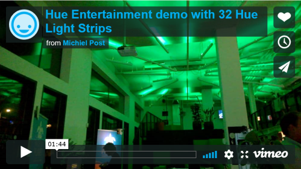
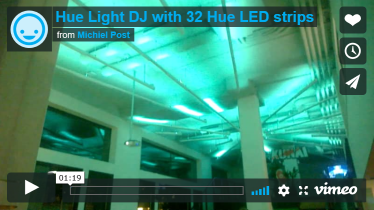
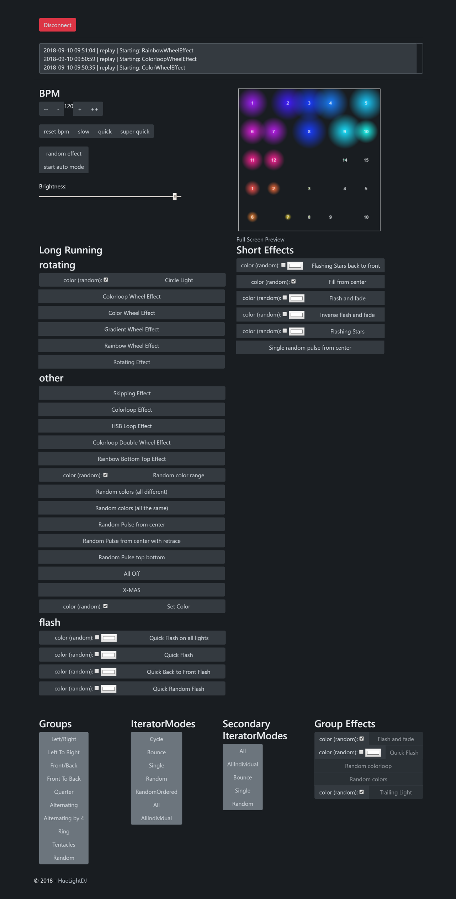
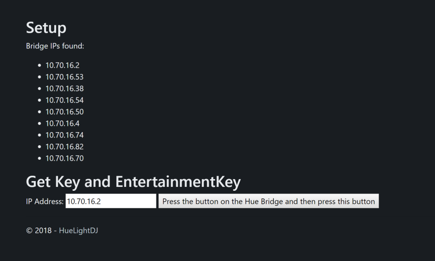
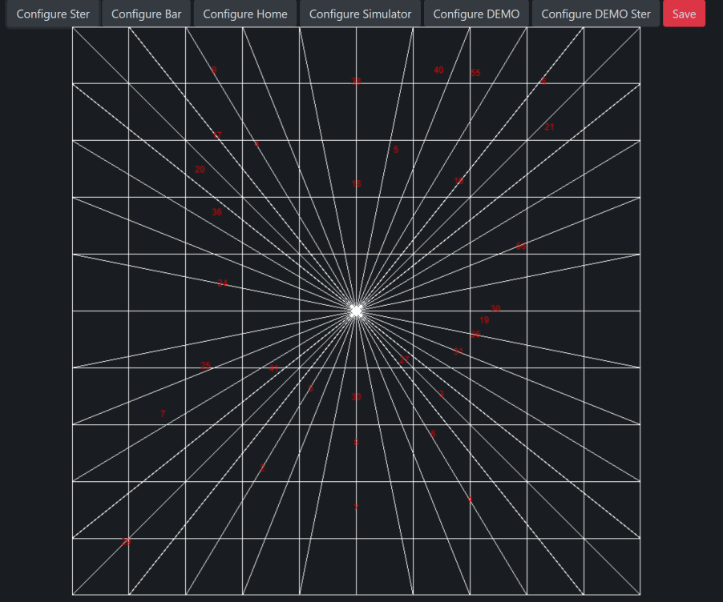

# HueLightDJ
Hue Light DJ using Hue Entertainment API

[](https://ci.appveyor.com/project/michielpost/huelightdj/branch/master)

## What is it?
This web app connects to a Philips Hue Bridge over the local network. It uses the Hue Entertainment API to update the lights almost instantly.
Hue Light DJ is meant for setups with 20+ Hue Lights. Don't use this app for your personal setup with less than 5 lights. Things might get interesting with 10 lights, you can try it out. There is also a DEMO mode build in so you see how it would look like on a 20+ light setup.

NOTE: [Hue Entertainment](https://developers.meethue.com/entertainment-blog) supports max 10 lights in an Entertainment Group. To get this to work with more than 10 lights, you need to have 1 bridge for every 10 lights. 

[](https://vimeo.com/292273983) [](https://vimeo.com/290011309)

## Features
- Comes with a lot of build in effects
- BPM input to specify speed of effects
- Preview window, to see the result of the effects
- Random mode, runs a random effect on a random group
- Auto mode (Party Mode), starts a new random effect every 6 seconds
- Build in groups like front/back, left/right
- Random group, creates a new random group every time
- Effect Composer, try out new effects by selecting a group, IteratorMode and effect
- Touch effect, click or touch the preview area to start an effect from that position
- Brightness Slider to control overall brightness
- DEMO mode, to test the app without a Hue Bridge
- Keyboard Shortcuts
- Connect to multiple Hue Bridges at the same time to control more than 10 lights 
- Multi Bridge light location configuration using the /Configure page

## Tech
- ASP.Net Core 2.1 backend
- SignalR for realtime communication between frontend and backend
- Q42.HueApi for communicating with the Hue Bridge
- Vue.js frontend
- PixiJS for WebGL preview window
- Mousetrap for keyboard shortcuts

## Build and Install Instructions
- Make sure to have ASP.Net Core 2.1 installed to build this project
- Get the IP, Key and EntertainmentKey for your Hue Bridge using the API or the included /Setup page (run the project and navigate to /setup)
- Enter the IP, Key and EntertainmentKey in appsettings.json
- Run the HueLightDJ.Web project(dotnet run inside the HueLightDJ.Web directory) 

## Docker
https://hub.docker.com/r/michielpost/huelightdj/
```
docker pull michielpost/huelightdj
docker run -d -p 8080:80 michielpost/huelightdj
```
HueLightDJ is now available on port 8080

## Feature Wishlist
- More build in effects
- Support for a hardware controller using WebMidi

## Screenshots




#### Disclaimer
This app not affiliated with the Light DJ series of light show apps by NRTHRNLIGHTS, LLC
